# 人工智慧期末作業：YOLOv5 口罩偵測（Google Colab）

## 組員
- 11125013 郭慧庭
- 11125032 林欣儀
- 11125036 夏振凱

---

## 一、前言與程式目的
本次期末作業的目標是使用 **YOLOv5 深度學習模型**，在 **Google Colab（GPU 環境）** 中完成「口罩配戴偵測（Mask Detection）」任務。  
依照教學流程下載公開資料集、訓練模型，並將訓練完成的權重實際應用於圖片與影片中，驗證模型對「有戴口罩 / 未戴口罩」之辨識能力。

- 題目教學來源：  
  https://www.topcfd.cn/18020/

---

## 二、資料集來源與說明
- 資料集來源：Roboflow 公開資料集  
  https://public.roboflow.com/
- 資料集名稱：Mask Wearing Dataset
- 類別（Classes）：
  - `mask`
  - `no-mask`
- 資料格式：YOLO v5 PyTorch 格式（含 `train / valid / test`）

---

## 三、實作環境
- 平台：Google Colab
- 硬體加速：GPU（Tesla T4）
- 深度學習框架：PyTorch
- 模型：YOLOv5
- torch / CUDA（依 Colab 實際分配為主；本次實作輸出為 torch 2.9.0、CUDA 12.6）

---

## 四、實作流程

### 第一步：下載資料集（Roboflow）
1. 進入 https://public.roboflow.com/
2. 選擇 **Mask Wearing Dataset**

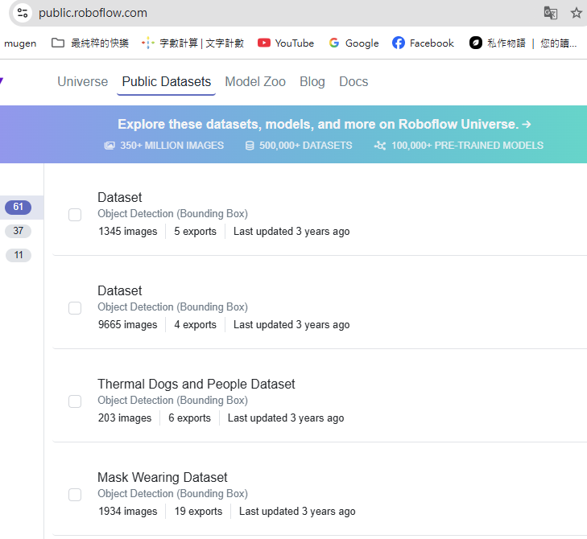

3. 點擊 **raw**


4. 選擇下載 **YOLO v5 PyTorch** 的壓縮檔

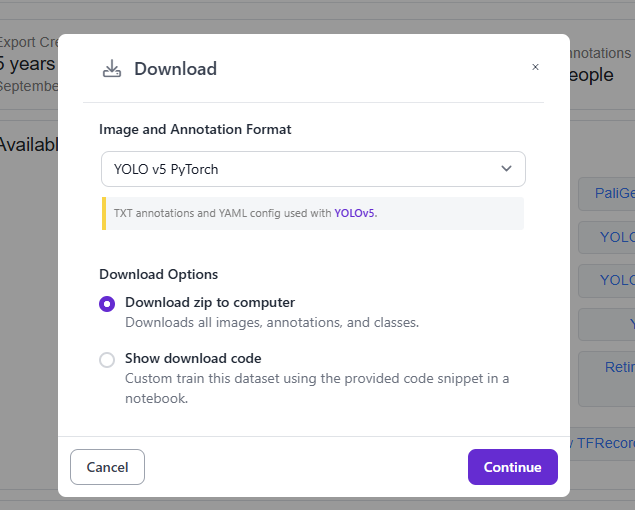

---

### 第二步：解壓與上傳至 Google Drive
將下載的檔案解壓後，資料夾更名為 **Mask**，並上傳至 Google Drive。


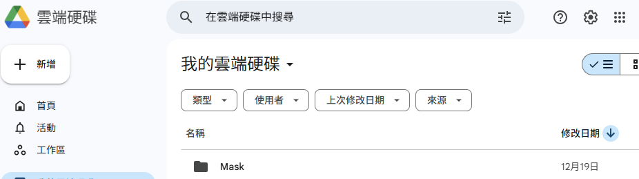

---

### 第三步：設定 Colab 使用 GPU
進入 Colab「筆記本設定 / 變更執行階段類型」，將加速器調整為 **GPU**。


---

### 第四步：掛載 Google Drive 並確認資料集檔案
運行（連結雲端資料）：
```python
from google.colab import drive
drive.mount('/content/drive')
```


接著輸入（切到 Mask 資料夾並確認檔案無誤）：
```python
import os
os.chdir('/content/drive/MyDrive/Mask')
!ls
```

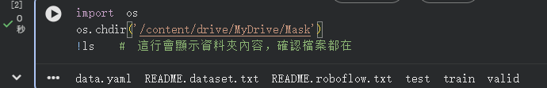

確認資料夾中包含 `train`、`valid`、`test` 與 `data.yaml`。

---

### 第五步：下載 YOLOv5 + 確認 GPU/版本 + 安裝套件
輸入（將路徑從 Mask 調整回 MyDrive，下載 YOLOv5 到雲端並解壓）：
```python
%cd /content/drive/MyDrive
!git clone https://github.com/ultralytics/yolov5
%cd yolov5
```
接著輸入（確認 GPU / torch / cuda 資訊）：
```python
import torch
from IPython.display import Image, clear_output

clear_output()
print('Setup complete. Using torch %s %s' % (
    torch.__version__,
    torch.cuda.get_device_properties(0) if torch.cuda.is_available() else 'CPU'
))
```

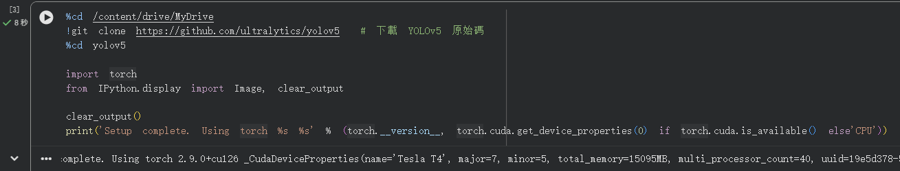

將路徑從 **Mask** 調整回 **MyDrive** ，接著將YOLOv5檔案從github下載到雲端中並解壓。
可從輸出字串中看見Colab分配了一個Tesla T4的顯卡，16G的GPU顯存。torch版本為2.9.0，cuda版本為12.6。
此為下載好的YOLOv5檔案：

\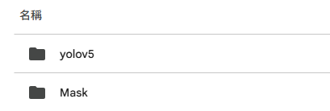

接著輸入（安裝 requirements.txt）：
```python
%pip install -qr requirements.txt
```


---

### 第六步：修正 data.yaml 路徑 + 修改模型類別數 nc
修改 `Mask/data.yaml` 中的路徑為正確內容：
```python
import yaml

yaml_path = '/content/drive/MyDrive/Mask/data.yaml'

with open(yaml_path, 'r') as f:
    data = yaml.safe_load(f)

data['path'] = '/content/drive/MyDrive/Mask'
data['train'] = 'train/images'
data['val'] = 'valid/images'
data['test'] = 'test/images'

with open(yaml_path, 'w') as f:
    yaml.dump(data, f)

print("✅ data.yaml 路徑已修正完畢！")
```


舊：

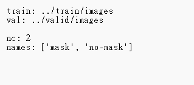

新：

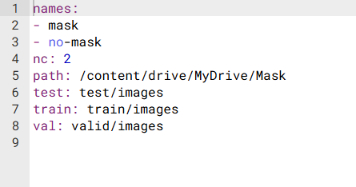

接著打開`yolov5/models/yolov5s.yaml`文件：


將`nc:80`修改為`nc:2`。
因為數據集中只有`mask`跟`no-mask`2種類別，此處需要類別數量一致。
舊：

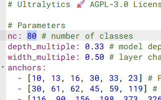

新：


數據集：

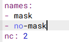

---

### 第七步：模型訓練（300 epochs）
進行模型訓練，次數與網站相同為 300 輪：
```python
%cd /content/drive/MyDrive/yolov5
!python train.py --img 640 --batch 16 --epochs 300 --data /content/drive/MyDrive/Mask/data.yaml --weights yolov5s.pt --cache
```


訓練好的權重文件通常存於：
- `yolov5/runs/train/exp/weights/best.pt`
通常使用 `best.pt`。


---

### 第八步：準備測試圖片（mask.jpg）
選一張與口罩相關的圖片，命名為 `mask.jpg`，放入 `yolov5` 資料夾。

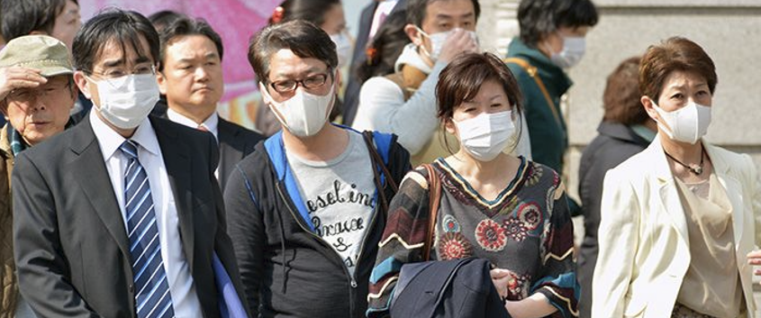

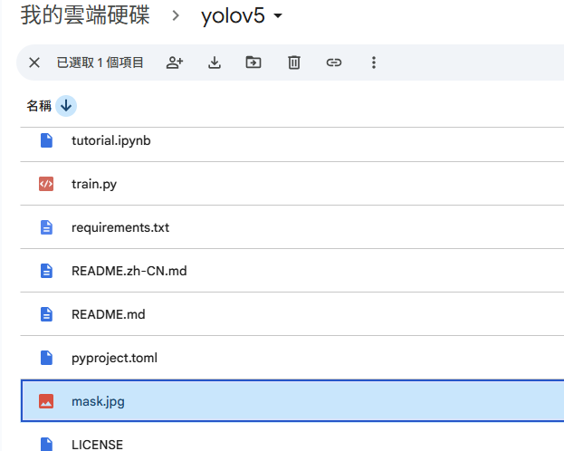

---

### 第九步：圖片偵測（mask.jpg）
輸入：
```python
!python detect.py --weights runs/train/exp/weights/best.pt --img 640 --conf 0.5 --source mask.jpg
```

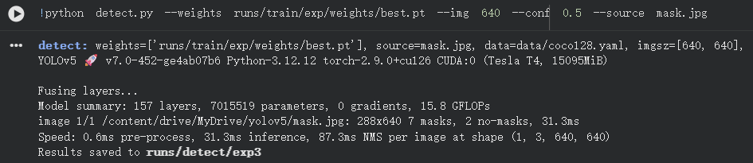

根據輸出內容，可見抓到 **7 人戴口罩**、**2 人沒戴口罩**。  
依輸出最後一行路徑（例如 `runs/detect/exp3`）開啟 `mask.jpg` 可見效果圖。


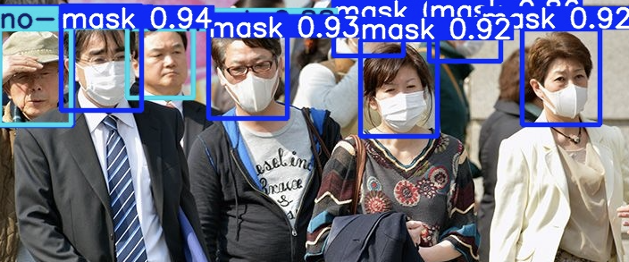

圖與輸出內容呈現一致，左邊人頭重疊，導致被遮住一個mask框，可從邊緣見到深藍色的框線。

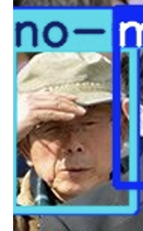

---

### 第十步：準備測試影片（mask.mp4）
鑒於原文影音無法使用，本次改為下載口罩相關影音，命名為 `mask.mp4`，並放入 `yolov5` 資料夾。


---

### 第十一步：影片偵測測試（mask.mp4）
輸入：
```python
!python detect.py --weights runs/train/exp/weights/best.pt --img 640 --conf 0.5 --source mask.mp4
```


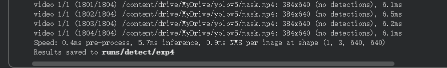
依輸出最後一行路徑（例如 `runs/detect/exp4`）開啟 `mask.mp4`。  

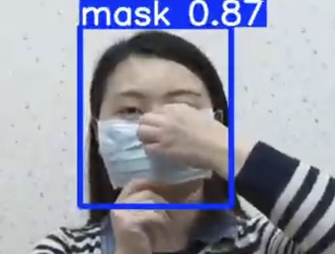


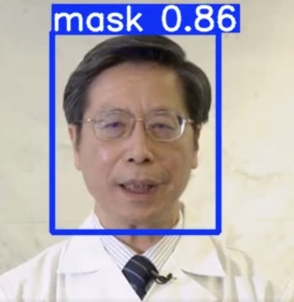

---

## 五、實驗結果
- 模型可辨識「有戴口罩（mask）」與「未戴口罩（no-mask）」
- 在多人或遮擋情況下仍可進行基本偵測，但偶有誤判或漏判
- 若需提升準確度，可增加資料量或延長訓練次數

---

## 六、成果展示
- 影片（Google Drive）：
  https://drive.google.com/file/d/1-NRvPbJlOjaWktjQ8H-lDuW9dI2Ru02g/view?usp=drive_link

---

## 七、結論
本次實作成功完成 YOLOv5 口罩偵測模型之訓練與應用。  
透過 Google Colab GPU 環境，可有效降低本地端硬體限制，並驗證深度學習模型於影像辨識應用上的可行性。
